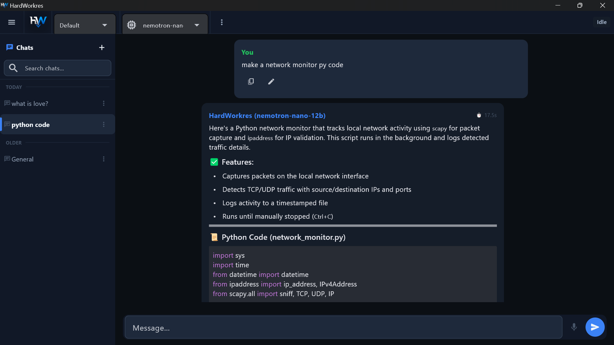

# HardWorkers

> AI-powered desktop assistant with semantic memory, multi-model chat, voice I/O, vision understanding, and autonomous agents.


---

## Screenshot





---

## Overview

HardWorkers is a desktop AI application that combines local and cloud AI models, long-term semantic memory, voice input/output, vision analysis, and an agent/automation pipeline — in a ChatGPT-style interface built with [Flet](https://flet.dev).

**Supported providers:** Ollama (local), OpenAI, Anthropic, Google Gemini, Groq, OpenRouter, Together AI, DeepSeek, and any OpenAI-compatible API.

---

## Architecture

```
                ┌──────────────────────┐
                │   ui/main_window.py   │  Flet desktop UI
                └──────────┬───────────┘
                           │
                ┌──────────▼───────────┐
                │   app/application.py  │  DI Container (16 services)
                └──────────┬───────────┘
                           │
   ┌──────────┬────────────┼────────────┬──────────┐
   ▼          ▼            ▼            ▼          ▼
Database   Memory       AI Providers   Voice      Vision
(SQLite)   (FAISS)    (Ollama + 18 APIs) (TTS/STT) (OCR/Vision)
   │
   ├── run_api.py   → FastAPI REST/WebSocket server (8 routers)
   ├── run_web.py   → same Flet UI served in browser
   └── frontend/    → React + Vite SPA (Chat / Workspaces / Login)
```

---

## Quick Start

### Prerequisites

- Python 3.11+
- [Ollama](https://ollama.ai) (for local models) — or API keys for cloud providers

### Install & Run

```bash
# Clone
git clone https://github.com/mohamed-hisham-swidan/hardworkers.git
cd hardworkers

# Virtual environment (recommended)
python -m venv .venv
# Windows: .venv\Scripts\activate
# macOS/Linux: source .venv/bin/activate

# Install dependencies
pip install -r requirements.txt

# Run desktop app
python main.py
```

For the API server: `python run_api.py`
For web mode: `python run_web.py`

See [INSTALL.md](INSTALL.md) for detailed setup, including optional dependencies for voice, vision, and training.

---

## Features

These are confirmed implemented and working (verified against the internal feature audit).

### Core Platform
- Flet desktop UI, FastAPI REST/WebSocket server, and an early-stage React SPA (Chat, Workspaces, Login pages) sharing the same backend
- DI container, event bus (pub/sub), Pydantic-based config and settings persistence
- Dark/Light/System theming, rotating file + console logging

### Chat
- Multi-provider chat (Ollama + 18 cloud API presets) with automatic or manual model routing
- Streaming responses, message editing, copy-to-clipboard, per-message text-to-speech
- Markdown/GFM rendering with code highlighting, token counting with history truncation
- Chat search, date grouping, pinning, and memory-aware system prompts

### Memory & Knowledge
- FAISS-based semantic memory with importance-scored retrieval
- Per-chat facts, auto-summarization, global user facts
- Knowledge extraction, concept analysis, relationship mapping, and backlink generation

### Voice
- Speech-to-text and text-to-speech with caching, language detection, and a waveform/recording indicator

### Vision
- Image paste/attach with automatic vision-model fallback and clipboard support (PIL, with a Windows-specific clipboard fallback)

### Autonomous Agents
- Full Observe–Analyze–Plan–Execute–Verify(OAPERVR) workflow with file I/O and code-analysis tools, cancellable streaming runs, and a live activity feed

### Obsidian Integration
- Vault reading, note generation, and structured import, wired with failure-tolerant startup

### Training Pipeline
- Dataset preparation, document import, LoRA fine-tune prep, and GGUF/LM Studio/Ollama adapters

### Model Management
- Ollama model creation/cloning and API model registration, with per-provider connection testing

---

## Known Limitations

Being upfront about what's not finished yet, instead of letting users discover it themselves:

- **"Change Model" button** in the toolbar currently shows a "not implemented yet" message — switch models from Settings instead.
- **OCR** (`pytesseract`) is a declared dependency but isn't wired into the UI yet.
- There's a duplicate, unused `VoiceController` implementation (~300 lines) left in the codebase; the app actually uses `MicController`. It will be removed or merged.
- The following subsystems are fully implemented in code but currently have **no automated test coverage**: vision pipeline, FastAPI routers, training pipeline, knowledge engine, expert/QA system, FAISS vector store, and the encryption utilities.

---

## Roadmap

```md
- [x] Desktop UI (Flet)
- [x] FastAPI REST/WebSocket server
- [x] Multi-provider chat (Ollama + 18 cloud APIs)
- [x] Semantic memory (FAISS)
- [x] Voice I/O
- [x] Vision / image understanding
- [x] Autonomous agents
- [ ] Obsidian integration
- [ ] Training pipeline (LoRA / GGUF)
- [ ] Wire up the "Change Model" toolbar action
- [ ] Finish OCR pipeline wiring
- [ ] Remove the unused legacy VoiceController
- [ ] Test coverage for vision, API, training, knowledge, experts/QA, vector store
- [ ] Polish the React web UI
- [ ] Packaged releases (Windows/macOS/Linux binaries)
- [ ] Plugin marketplace
- [ ] Mobile companion app
- [ ] MCP (Model Context Protocol) support
```

---

## Testing

295 tests across 12 files — agent runner/context, database (integration, real SQLite), event bus (schema + versioning), domain models, audio/TTS (including concurrency/stress), settings persistence, utilities, and UI immutability. No skeleton tests; all real assertions.

```bash
pytest
```

Not yet covered (see [Known Limitations](#known-limitations)): vision, FastAPI routers, training pipeline, knowledge engine, experts/QA, vector store, encryption.

---

## Configuration

Configuration is loaded from environment variables or a `.env` file. Copy `.env.example` to `.env` and customize:

```env
OLLAMA_BASE_URL=http://localhost:11434
DB_PATH=./data/hardworkers.db
LOG_DIR=./logs
UI_WIDTH=1280
UI_HEIGHT=900
```

For production deployments, always set `JWT_SECRET` to a strong random value and change the default `ADMIN_PASSWORD`.

---

## Project Structure

```
hardworkers/
├── app/              # DI & application bootstrap
├── agent/            # Autonomous agent system
├── api/              # FastAPI REST/WebSocket server
├── backend/          # Voice subsystem (STT, TTS, audio)
├── config/           # Environment config & constants
├── core/             # DI container, event bus, interfaces, environment validation
├── database/         # SQLite connection, migrations, repositories
├── docs/             # Architecture documentation
├── experts/          # Domain expert modules
├── frontend/         # React + Vite web UI (early stage)
├── knowledge/        # Knowledge extraction & relationship mapping
├── memory/           # Semantic memory & summarization
├── models/           # Domain data models & enums
├── obsidian/         # Obsidian vault integration
├── qa/               # Quality assurance validators
├── services/         # Business logic & AI integrations
├── settings/         # User settings persistence
├── tests/            # Test suite
├── training/         # Model training pipeline
├── ui/               # Flet desktop UI components
├── utils/            # Logging, HTTP, crypto, helpers
├── vectorstore/      # FAISS vector index wrapper
├── vision/           # Image processing & vision
├── vault/            # Obsidian vault data store
├── main.py           # Desktop entry point
├── run_api.py        # API server entry point
└── run_web.py        # Web mode entry point
```

---

## Dependencies

| Category | Packages |
|----------|----------|
| **Core** | flet, requests, numpy, tiktoken, pillow |
| **Vector Store** | faiss-cpu, sentence-transformers |
| **Voice** | SpeechRecognition, pyttsx3 |
| **Vision** | pytesseract |
| **API Server** | fastapi, uvicorn, python-jose, pydantic, websockets |
| **Documents** | pypdf, python-docx, beautifulsoup4, pyyaml |
| **Security** | cryptography |
| **Windows** | pywin32 (clipboard access) |

Optional: `transformers`, `torch`, `datasets` for training; `opencv-python` for advanced image processing; `edge-tts` for enhanced TTS.

---

## Keyboard Shortcuts

| Shortcut | Action |
|----------|--------|
| `Enter` | Send message |
| `Shift+Enter` | New line |
| `Ctrl+N` | New chat |
| `Ctrl+E` | Focus input |
| `Ctrl+B` | Toggle sidebar |
| `Ctrl+V` | Paste image |
| `Ctrl+L` | Clear chat |
| `Ctrl+S` | Open settings |
| `Escape` | Focus input |

---

## Contributing

We welcome contributions! See [CONTRIBUTING.md](CONTRIBUTING.md) for development setup, code style, and PR process.

## Changelog

See [CHANGELOG.md](CHANGELOG.md) for version history.

## Security

See [SECURITY.md](SECURITY.md) for reporting vulnerabilities.

## License

MIT — see [LICENSE](LICENSE).
